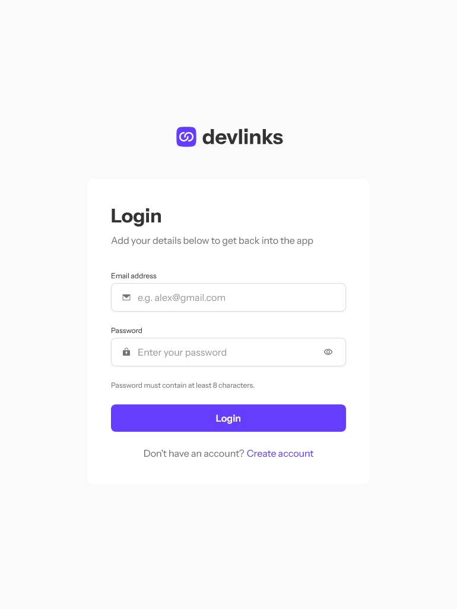
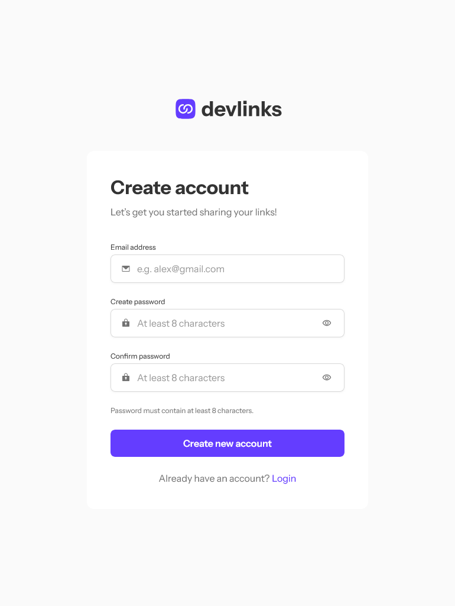
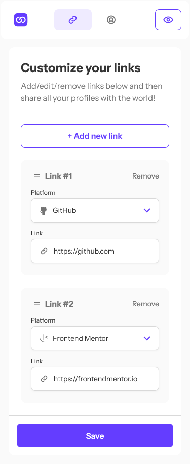
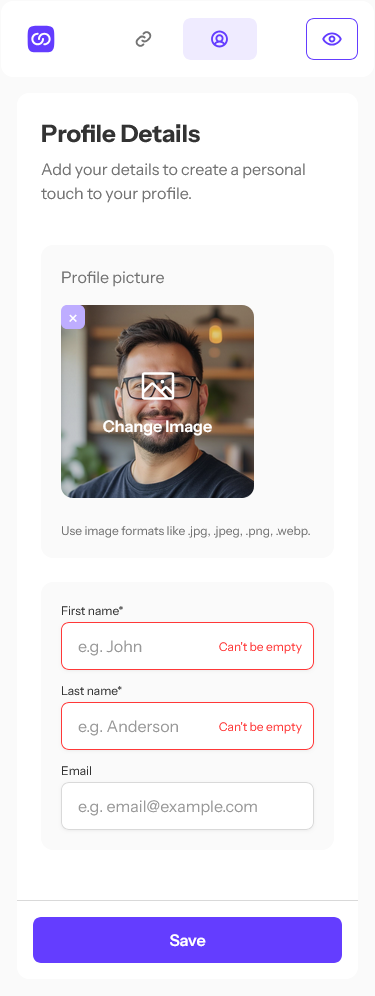
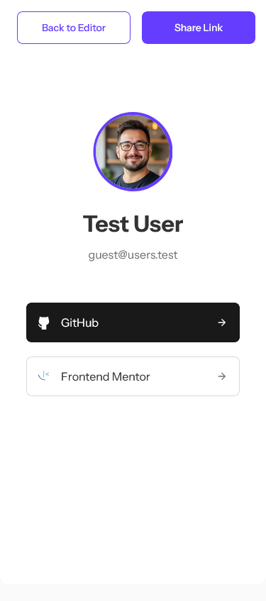
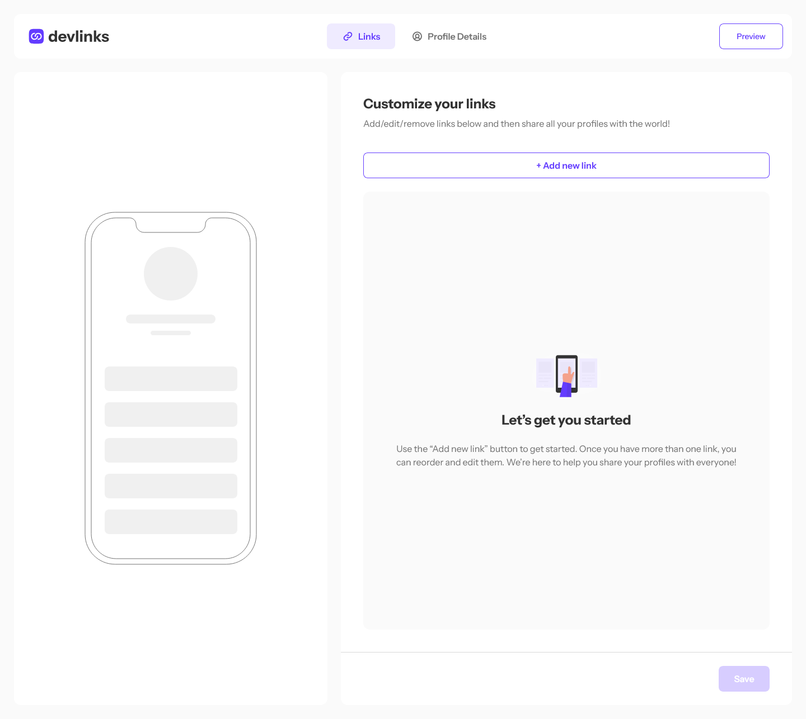
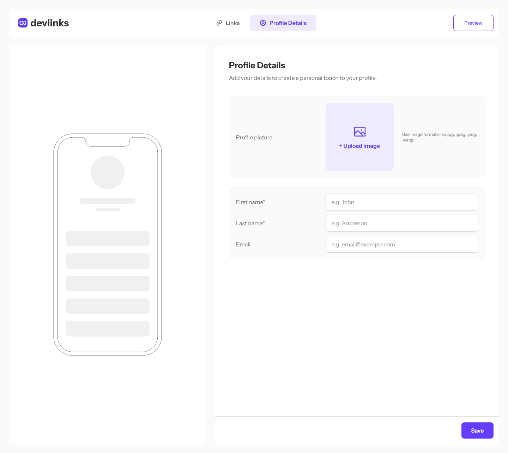
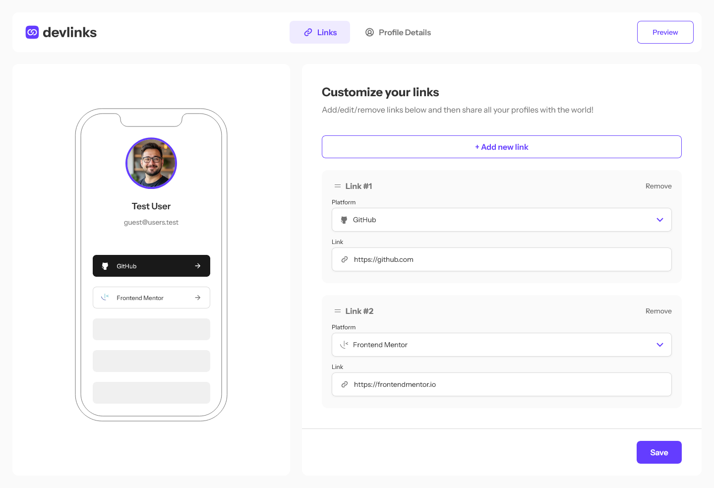
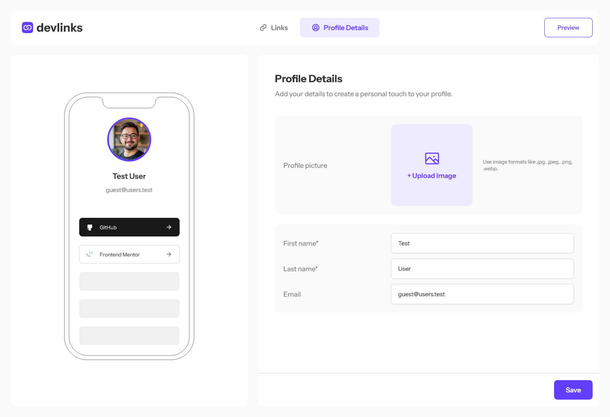
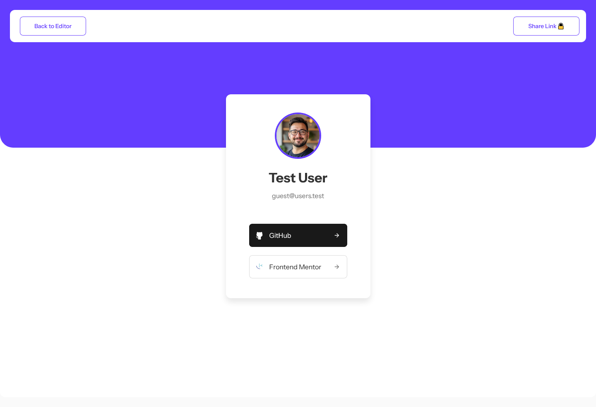

# DevLinks - Link Sharing Application

A modern, full-stack link-sharing platform built with Next.js that empowers users to create, manage, and share their professional links in a beautiful, customizable profile. DevLinks provides a seamless experience for both guest users and registered users, with intelligent session management and comprehensive profile validation.

## 🚀 Features

### Core Features

- **Link Management**: Create, read, update, and delete links with real-time preview
- **Drag & Drop**: Reorder links with intuitive drag-and-drop functionality
- **Image Upload**: Profile picture upload with Cloudinary integration
- **Profile Customization**: Add profile picture, name, and email with live preview
- **Link Validation**: Smart URL validation for different platforms (GitHub, LinkedIn, etc.)
- **Mobile Mockup**: Real-time preview of how your profile looks on mobile
- **Share Profile**: Generate a public shareable profile link
- **Responsive Design**: Optimized for desktop, tablet, and mobile devices

### User Experience Features

- **Guest Mode**: Try the app without registration with automatic guest session creation
- **Session Management**: Intelligent session handling for both guests and registered users
- **Profile Validation**: Smart validation system that guides users to complete their profiles
- **Warning Banners**: Dynamic highlighting of incomplete profile sections
- **User Authentication**: Secure sign-up and sign-in system with session persistence
- **Data Migration**: Seamless transfer of guest data to registered accounts
- **Auto-Termination Warnings**: Clear notifications about guest session expiration

## 📊 User Journey & Flow

This application follows a carefully designed user experience flow that accommodates both guest users and registered users. We have documented the complete user journey using Mermaid diagrams:

### 📋 User Journey Documentation

- **[Main User Journey](./user-journey.mermaid)** - Complete flow from initial visit to profile sharing
- **[Validation Flow Details](./user-journey-validation-flow.mermaid)** - Detailed validation and error fixing workflows

### 🔍 Understanding the User Flow

**Guest User Experience:**

1. First-time visitors can immediately start creating links or profiles
2. Automatic guest session creation with termination warnings
3. Full editing capabilities with preview functionality
4. Share restrictions that encourage registration
5. Seamless data transfer when upgrading to registered account

**Registered User Experience:**

1. Persistent sessions with expiration handling
2. Complete profile validation before sharing
3. Smart warning banners for incomplete sections
4. Flexible editing workflow (links or profile first)
5. Successful sharing with clipboard integration

**Session Management:**

- Guest sessions with auto-termination warnings
- Expired session recovery options
- Seamless transition between guest and registered states

### 🎨 Visual Flow Elements

The user journey diagrams use color-coded elements for clarity:

- 🟢 **Green**: Entry points and main pages
- 🟠 **Orange**: Decision points and user choices
- 🔵 **Blue**: Process steps and actions
- 🟣 **Purple**: Guest-specific functionality
- 🟡 **Yellow**: Warning states and notifications
- 🟢 **Light Green**: Success states and completions

## 🛠️ Tech Stack

### Frontend

- **Next.js 15** - React framework with App Router
- **React.js 19** - UI library
- **TypeScript** - Type safety
- **Tailwind CSS 4** - Styling framework
- **Shadcn UI** - Shadcn custom Accessible components
- **DND Kit** - Drag and drop functionality
- **Sonner** - Toast notifications

### Backend & Database

- **Next.js App Router** - Server side rendering and routing using the new App Router
- **Server Actions** - Server actions for data mutations and form handling
- **Authentication** - Custom authentication system with session management
- **Cloudinary** - Image hosting and optimization
- **MongoDB 6.16.0** - Database

## 📦 Installation

1. **Clone the repository**

   ```bash
   git clone https://github.com/AhmadYousif89/devlinks
   cd devlinks
   ```

2. **Install dependencies**

   ```bash
   npm install
   ```

3. **Set up environment variables**
   Create a `.env` file in the root directory:

   ```env
   MONGODB_URI=your_mongodb_connection_string
   MONGODB_NAME=your_mongodb_database_name
   CLOUDINARY_CLOUD_NAME=your_cloudinary_cloud_name
   CLOUDINARY_API_KEY=your_cloudinary_api_key
   CLOUDINARY_API_SECRET=your_cloudinary_api_secret
   USER_SESSION_KEY=your_user_session_key
   CURRENT_USER_KEY=your_current_user_key
   GUEST_SESSION_KEY=your_guest_session_key
   SESSION_EXPIRE_TIME=your_session_expire_time
   GUEST_SESSION_EXPIRE_TIME=your_guest_session_expire_time
   EXPIRED_NOTIFICATION_TIME=your_expired_notification_time
   ```

4. **Run the development server**

   ```bash
   npm run dev
   ```

5. **Open your browser**
   Navigate to [http://localhost:3000](http://localhost:3000)

## 🏗️ Project Structure

```
devlinks/
├── src/
│   ├── app/                        # Next.js App Router
│   │   ├── (auth)/                 # Authentication pages
│   │   │   ├── signin/             # Sign in page
│   │   │   ├── signup/             # Sign up page
│   │   │   └── _components/        # Auth-specific components
│   │   ├── (main)/                 # Main application
│   │   │   ├── @addLinks/          # Parallel route for link management
│   │   │   ├── @profileDetails/    # Parallel route for profile
│   │   │   ├── @sidePanel/         # Parallel route for side panel
│   │   │   ├── actions/            # Server actions
│   │   │   ├── components/         # Page-specific components
│   │   │   └── skeletons/          # Loading skeletons
│   │   ├── preview/                # Profile preview page
│   │   └── globals.css             # Global styles
│   ├── components/                 # Reusable components
│   │   ├── ui/                     # Shadcn UI components (buttons, inputs, etc.)
│   │   ├── layout/                 # General Layout components
│   │   └── icons/                  # Custom icons components
│   └── lib/                        # Utilities and configurations
│       ├── db.ts                   # Database connection
│       ├── utils.ts                # Utility functions
│       ├── types.ts                # Type definitions
│       └── constants.ts            # App constants
├── public/
│   ├── assets/                     # Static assets
│       ├── images/                 # SVG icons and images
│       └── fonts/                  # Custom fonts
|   └── screenshots/                # Screenshots of the app
└── components.json                 # Shadcn/ui configuration
```

## 📱 Pictures

**Sign In / Sign Up**

<div style="display: flex; gap: 20px; margin-bottom: 20px; justify-content: center;">
  
  
</div>

**Mobile Active**

<div style="display: flex; gap: 20px; margin-bottom: 20px; justify-content: center;">
   
   
   
</div>

**Desktop**

<div style="display: flex; gap: 20px; margin-bottom: 20px; justify-content: center;">
   
   
</div>

**Desktop Active**

<div style="display: flex; gap: 20px; margin-bottom: 20px; justify-content: center;">
   
   
   
</div>

## 🎯 Usage

### Getting Started

**For New Users:**

1. Visit the application and land on the home page
2. Start creating links or editing your profile (automatic guest session)
3. Receive a welcome notification about guest session limitations
4. Edit your profile and links in any order you prefer
5. Preview your DevLinks profile to see how it looks
6. When ready to share, sign up to unlock sharing features

**For Registered Users:**

1. Sign in to access your saved profile and links
2. Edit your profile and links with full functionality
3. Use the preview feature to validate your profile
4. Fix any missing information using the guided validation system
5. Share your complete DevLinks profile with the world

### Managing Links

1. Click "Add new link" to create a link
2. Select link platform from a dropdown menu
3. Enter the URL for that platform
4. Drag and drop to reorder links
5. Click "Save" to persist changes

### Profile Details

1. Uploading a profile picture (Optional)
2. Adding your first and last name (Required)
3. Adding an email address (Optional) **(Will only update the displayed profile email without affecting user's registered email)**
4. Save your profile details

### Sharing Your Profile

1. Click "Preview" to see your public profile
2. The system automatically validates your profile and links
3. If information is missing, you'll see a warning modal with options:
   - **Back to Editor**: Fix missing information with guided banners
   - **Share Anyway**: Share your profile as-is
4. Choose your preferred tab (Links or Profile) to fix issues
5. Warning banners will guide you to missing information
6. Once complete, return to preview and share your profile
7. Success! Your shareable link is created and copied to clipboard

## 🚦 Scripts

- `npm run dev` - Start development server with Turbopack
- `npm run build` - Build the application for production
- `npm run start` - Start the production server
- `npm run lint` - Run ESLint for code quality

## 🌟 Key Features Implementation

### Guest Session Management

Intelligent guest session creation that allows users to try the app without registration, with clear warnings about session limitations and automatic data transfer upon registration.

### Smart Validation System

Comprehensive validation that guides users through completing their profiles with dynamic warning banners and flexible editing workflows.

### Flexible User Flow

Users can choose their own path when fixing validation issues - start with links or profile, completely user-driven experience.

### Drag & Drop

Implemented using DND Kit for smooth, accessible drag-and-drop functionality.

### Real-time Preview

Live preview updates as you modify links and profile information.

### Form Validation

Comprehensive validation for URLs, required fields, and platform-specific patterns.

### Image Upload

Cloudinary integration for optimized image upload and delivery.

### Authentication

Enhanced authentication system with session management for both guest and registered users, including session expiration handling and data migration.

### Preview Validation

Preview validation to ensure links and profile information are complete before sharing.

### Responsive Design

Mobile-first approach with Tailwind CSS for consistent experience across devices.

## 📄 License

This project is licensed under the BSD License - see the [Licence](Licence) file for details.

## 🤝 Contributing

1. Fork the repository
2. Create a feature branch (`git checkout -b feature/amazing-feature`)
3. Commit your changes (`git commit -m 'Add some amazing feature'`)
4. Push to the branch (`git push origin feature/amazing-feature`)
5. Open a Pull Request

---

## Author

Ahmad Yousif

[GitHub](https://github.com/AhmadYousif89)

[Linkedin](https://www.linkedin.com/in/dev-ahmadyousif/)

[Frontendmentor](https://www.frontendmentor.io/profile/ahmadyousif89)

Built with ❤️ using Next.js and modern web technologies.
